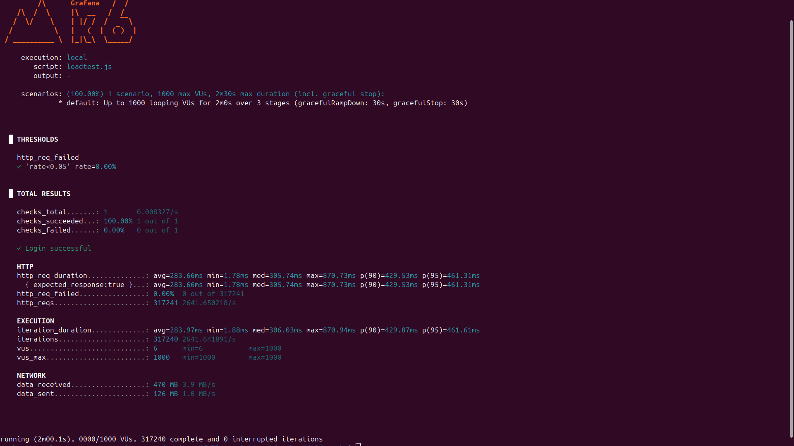
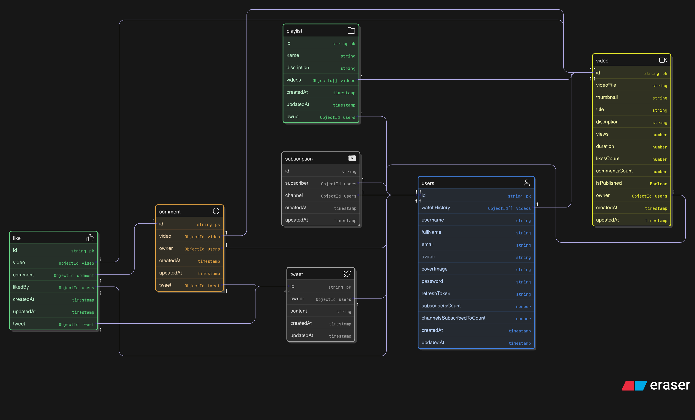

# VideoTube - A NodeJS Video Sharing Platform

   

VideoTube is a robust, scalable backend for a video-sharing platform modeled after YouTube. Unlike standard CRUD applications, this project handles high concurrency through advanced **Node.js Clustering** and **Database Indexing**, making it production-ready for heavy loads.

---

## 🚀 Key Performance Highlights

This system was engineered to solve the "Single-Threaded Bottleneck" of Node.js.

### ⚡ Optimization Strategy

1.  **Node.js Clustering:** Implemented a Primary-Worker architecture to utilize all CPU cores (12 workers), bypassing the default single-threaded limit.
2.  **Database Indexing:** Implemented Compound Indexes (ESR Pattern) on MongoDB to ensure sub-second response times for complex sort-and-filter queries.

### 📊 Load Test Results (k6)

Benchmarked on a Ryzen 5 (12-core) machine with 8GB RAM:

- **Concurrency:** Handled **1,000 Simultaneous Users**.
- **Throughput:** ~25,000 requests/minute.
- **Latency:** Maintained <600ms average response time under maximum load.
- **Stability:** **0.00% Error Rate** during stress testing.

### Load Test Summary

_k6 results demonstrating 1k VUs and 0% errors_



---

## 📂 Database Schema Design

The backend manages complex relationships between Users, Videos, Comments, Tweets, and Playlists. The schema is designed for scalability, utilizing references for relational data and specific indexes for performance.



---

## ✨ Features

- **User Authentication**: Secure user registration and login using JWT (JSON Web Tokens).
- **Video Management**: Upload, publish, and manage videos with Cloudinary integration for media storage.
- **Social Features**: Like, comment, and subscribe to channels.
- **Playlist Management**: Create and manage playlists of videos.
- **Tweet Functionality**: Post and manage tweets.
- **Dashboard**: View channel statistics and analytics.
- **Health Check**: Endpoint to monitor the application's health.

## 🛠️ Tech Stack

- **Backend**: NodeJS, ExpressJS
- **Database**: MongoDB with Mongoose
- **Authentication**: JWT (JSON Web Tokens), bcrypt
- **Media Storage**: Cloudinary
- **Logging**: Winston
- **Validation**: express-validator
- **Clustering**: node:cluster for performance

## 🧪 API Endpoints

### 👤 Authentication

- `POST /api/v1/auth/register`: 🚪 Register a new user.
  - **Body**: `username`, `email`, `fullName`, `password`
  - **Multipart/form-data**: `avatar`, `coverImage`
- `POST /api/v1/auth/login`: 🔑 Login a user.
  - **Body**: `email` or `username`, `password`
- `POST /api/v1/auth/logout`: 🔒 Logout a user (requires authentication).
- `POST /api/v1/auth/refresh-access-token`: 🔄 Refresh the access token.
- `POST /api/v1/auth/change-password`: 🔐 Change the user's password (requires authentication).
  - **Body**: `currentPassword`, `newPassword`
- `GET /api/v1/auth/get-current-user`: 🙋‍♂️ Get the current logged-in user's details (requires authentication).
- `PUT /api/v1/auth/update-account-details`: 📝 Update the user's account details (requires authentication).
  - **Body**: `fullName`, `email`
- `PUT /api/v1/auth/update-avatar`: 🖼️ Update the user's avatar (requires authentication).
  - **Multipart/form-data**: `avatar`
- `PUT /api/v1/auth/update-cover-image`: 🌄 Update the user's cover image (requires authentication).
  - **Multipart/form-data**: `coverImage`
- `GET /api/v1/auth/channel/:username`: 📺 Get a user's channel profile.
- `GET /api/v1/auth/watch-history`: 📜 Get the user's watch history (requires authentication).

### 🎥 Video

- `POST /api/v1/videos/publish-video`: 📤 Publish a new video (requires authentication).
  - **Multipart/form-data**: `videoFile`, `thumbnail`
  - **Body**: `title`, `description`
- `GET /api/v1/videos`: 🎬 Get all videos with optional query parameters for pagination, sorting, and filtering.
- `GET /api/v1/videos/get-video-by-id/:videoId`: 📹 Get a single video by its ID (requires authentication).
- `PUT /api/v1/videos/update-video/:videoId`: ✏️ Update a video's details (requires authentication).
  - **Multipart/form-data**: `thumbnail`
  - **Body**: `title`, `description`
- `DELETE /api/v1/videos/delete-video/:videoId`: 🗑️ Delete a video (requires authentication).
- `PATCH /api/v1/videos/toggle-publish-status/:videoId`: 🔄 Toggle the publish status of a video (requires authentication).
- `GET /api/v1/videos/get-user-videos/:userId`: 🧑‍💻 Get all videos for a specific user.
- `GET /api/v1/videos/trending`: 🔥 Get trending videos.
- `GET /api/v1/videos/search/query`: 🔎 Search for videos.

### 💬 Comments

- `GET /api/v1/comments/get-comments-by-video/:videoId`: 🗨️ Get all comments for a specific video.
- `POST /api/v1/comments/add-comment/:videoId`: 💬 Add a comment to a video (requires authentication).
  - **Body**: `content`
- `PUT /api/v1/comments/update-comment/:commentId`: 📝 Update a comment (requires authentication).
  - **Body**: `content`
- `DELETE /api/v1/comments/delete-comment/:commentId`: 🗑️ Delete a comment (requires authentication).
- `GET /api/v1/comments/get-comments-by-tweet/:tweetId`: 🗨️ Get all comments for a specific tweet.
- `POST /api/v1/comments/add-tweet-comment/:tweetId`: 💬 Add a comment to a tweet (requires authentication).
  - **Body**: `content`
- `PUT /api/v1/comments/update-tweet-comment/:commentId`: 📝 Update a tweet comment (requires authentication).
  - **Body**: `content`
- `DELETE /api/v1/comments/delete-tweet-comment/:commentId`: 🗑️ Delete a tweet comment (requires authentication).

### 📊 Dashboard

- `GET /api/v1/dashboard/get-channel-stats/:channelId`: 📈 Get statistics for a specific channel.
- `GET /api/v1/dashboard/get-channel-videos/:channelId`: 📹 Get all videos for a specific channel.

### 👍 Likes

- `POST /api/v1/likes/toggle-video-like/:videoId`: 👍 Toggle a like on a video (requires authentication).
- `POST /api/v1/likes/toggle-comment-like/:commentId`: 👍 Toggle a like on a comment (requires authentication).
- `POST /api/v1/likes/toggle-tweet-like/:tweetId`: 👍 Toggle a like on a tweet (requires authentication).
- `GET /api/v1/likes`: ❤️ Get all liked videos by the current user (requires authentication).

### 📚 Playlists

- `POST /api/v1/playlists/create-playlist`: ➕ Create a new playlist (requires authentication).
  - **Body**: `name`, `description`
- `GET /api/v1/playlists/get-user-playlists/:userId`: 🧑‍💻 Get all playlists for a specific user.
- `GET /api/v1/playlists/get-playlist-by-id/:playlistId`:  playlist by its ID.
- `POST /api/v1/playlists/add-video-to-playlist/:playlistId/:videoId`: 📲 Add a video to a playlist (requires authentication).
- `POST /api/v1/playlists/remove-video-from-playlist/:playlistId/:videoId`: ➖ Remove a video from a playlist (requires authentication).
- `PUT /api/v1/playlists/update-playlist/:playlistId`: 📝 Update a playlist's details (requires authentication).
  - **Body**: `name`, `description`
- `DELETE /api/v1/playlists/delete-playlist/:playlistId`: 🗑️ Delete a playlist (requires authentication).

### 📺 Subscriptions

- `POST /api/v1/subscriptions/toggle-subscription/:channelId`: 🔔 Toggle a subscription to a channel (requires authentication).
- `GET /api/v1/subscriptions/get-user-channel-subscribers/:channelId`: 🧑‍🤝‍🧑 Get all subscribers for a specific channel.
- `GET /api/v1/subscriptions/my-subscribed-channels`: 📺 Get all channels subscribed to by the current user (requires authentication).

### 🐦 Tweets

- `POST /api/v1/tweets/create-tweet`: ➕ Create a new tweet (requires authentication).
  - **Body**: `content`
- `GET /api/v1/tweets/user-tweets/:userId`: 🧑‍💻 Get all tweets for a specific user (requires authentication).
- `PUT /api/v1/tweets/update-tweet/:tweetId`: 📝 Update a tweet (requires authentication).
  - **Body**: `content`
- `DELETE /api/v1/tweets/delete-tweet/:tweetId`: 🗑️ Delete a tweet (requires authentication).
- `GET /api/v1/tweets/all-tweets`: 🌐 Get all tweets (requires authentication).

## Getting Started

### Prerequisites

- NodeJS (v18 or higher)
- MongoDB
- Cloudinary Account

### ⚙️ Installation

1. Clone the repository:
   ```bash
   git clone https://your-repository-url.git
   ```
2. Install dependencies:
   ```bash
   npm install
   ```
3. Set up environment variables (see `.env.example`).
4. Start the development server:
   ```bash
   npm run dev
   ```

## Environment Variables

To run this project, you will need to add the following environment variables to your `.env` file:

`PORT`
`MONGO_URI`
`CORS_ORIGIN`
`ACCESS_TOKEN_SECRET`
`ACCESS_TOKEN_EXPIRY`
`REFRESH_TOKEN_SECRET`
`REFRESH_TOKEN_EXPIRY`
`CLOUDINARY_CLOUD_NAME`
`CLOUDINARY_API_KEY`
`CLOUDINARY_API_SECERET`

## Contributing

Contributions are welcome! Please feel free to submit a pull request.

## License

This project is licensed under the MIT License.
